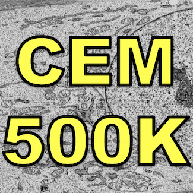
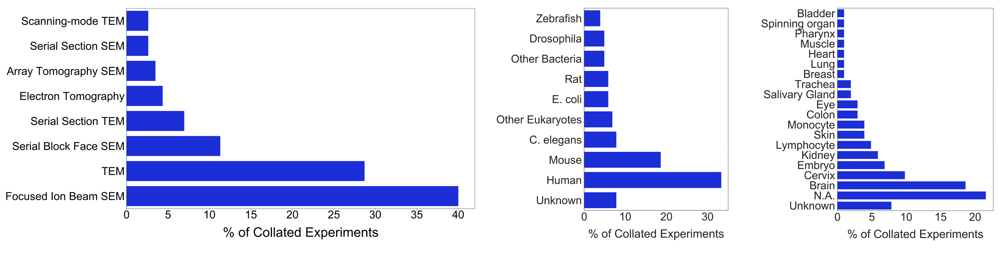
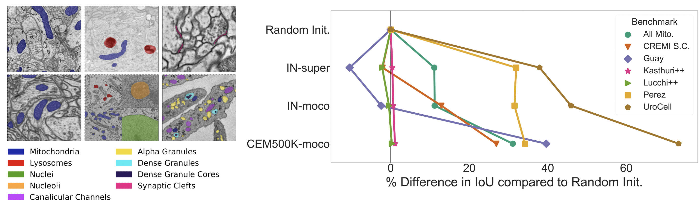

# CellEMNet

[](https://paperswithcode.com/sota/electron-microscopy-image-segmentation-on-1?p=cem500k-a-large-scale-heterogeneous-unlabeled)


Code for the paper: [CEM500K - A large-scale heterogeneous unlabeled cellular electron microscopy image dataset for deep learning.](https://www.biorxiv.org/content/10.1101/2020.12.11.421792v2)

## About the Dataset

<figure>
  </img>
</figure>

Typical EM datasets are created and shared to further biological research. Often that means that the sample size is n=1 (one instrument, one sample preparation protocol, one organism, one tissue, one cell line, etc.) and usually such datasets are hundreds of gigabytes to terabytes in size. For deep learning it is obviously true that a neural network trained on a dataset of 1,000 images from 1,000 different EM experiments will generalize better than the equivalent trained on 1,000 images from 1 EM experiment. CEM500K is an attempt to build a better dataset for deep learning by collecting and curating data from as many different EM experiments as possible. In total, we put together data from 102 unrelated EM experiments. Here's a breakdown of the biological details:

<figure>
  </img>
</figure>

## About Pre-trained Weights

Using CEM500K for unsupervised pre-training, we demonstrated a significant improvement in the performance of a 2D U-Net on a number of 2D AND 3D EM segmentation tasks. Pre-trained models not only achieved better IoU scores than random initialization, but also outperformed state-of-the-art results on all benchmarks for which comparison was possible. Even better CEM500K pre-training enabled models to converge much more quickly (some models took only 45 seconds to train!). See ```evaluation``` for a quick and easy way to use the pre-trained weights.

<figure>
  </img>
  <figcaption>Right: Example benchmark datasets. Left: IoU score improvements over random init. using CEM500K pre-trained weights (bottom row). See paper for more details.</figcaption>
</figure>

## Getting Started

First clone this repository:

```
git clone https://github.com/volume-em/cellemnet
```

If using conda, install dependencies in a new environment:

```
cd cellemnet
conda env create -f environment.yml
```

Otherwise, required dependencies can be installed with another package manager (pip):
- torch
- torchvision
- segmentation-models-pytorch
- albumentations
- h5py
- mlflow
- simpleitk
- scikit-learn
- imagehash

## Download CEM500K

The CEM500K dataset, metadata and pretrained_weights are available through [EMPIAR ID 10592](https://www.ebi.ac.uk/pdbe/emdb/empiar/entry/10592/).

## Use the pre-trained weights

Currently, pre-trained weights are only available for PyTorch. For an example of how to use them see ```evaluation/benchmark_configs``` and ```notebooks/pretrained_weights.ipynb```.

We're working to convert the weights for use with TensorFlow/Keras. If you have any experience with this kind of conversion and would like to help with testing, please open an issue.

## Data Curation

For image deduplication and filtering routines see the ```dataset``` directory README. Results on a small example 3D image volume can be reviewed in ```notebooks/deduplication_and_filtering.ipynb```.

## Citing this work

Please cite this work.
```bibtex
@article {Conrad2020.12.11.421792,
	author = {Conrad, Ryan W and Narayan, Kedar},
	title = {CEM500K - A large-scale heterogeneous unlabeled cellular electron microscopy image dataset for deep learning.},
	elocation-id = {2020.12.11.421792},
	year = {2020},
	doi = {10.1101/2020.12.11.421792},
	publisher = {Cold Spring Harbor Laboratory},
	URL = {https://www.biorxiv.org/content/early/2020/12/11/2020.12.11.421792},
	eprint = {https://www.biorxiv.org/content/early/2020/12/11/2020.12.11.421792.full.pdf},
	journal = {bioRxiv}
}
```